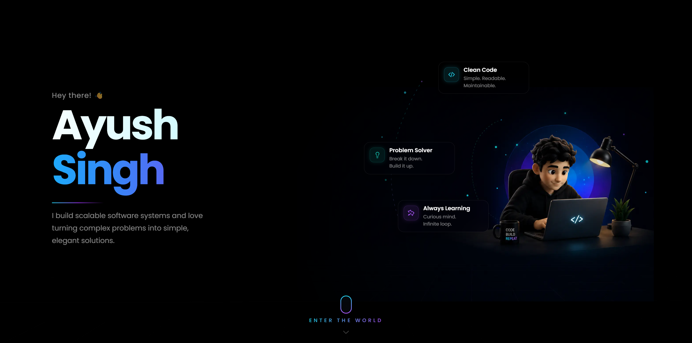
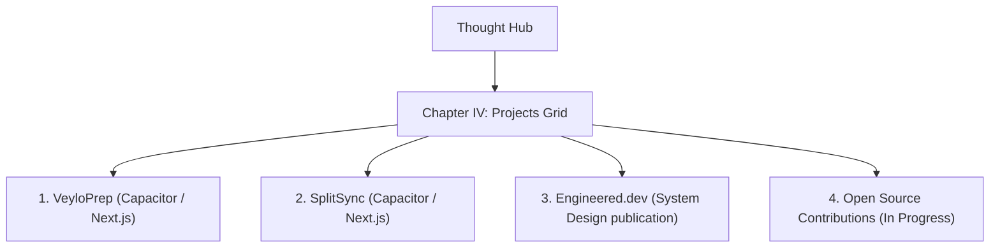

<div align="center">

# PROJECT NEXUS

### The Architecture of Thought

An interactive, cinematic portfolio experience that visualizes the journey of an engineer's mind.

[](https://nextjs.org/)
[](https://react.dev/)
[](https://www.typescriptlang.org/)
[](https://tailwindcss.com/)
[](https://gsap.com/)
[](https://threejs.org/)

[Explore the Codebase](https://github.com/Ayushxsingh100/NEXUS) · [LinkedIn](https://www.linkedin.com/in/ayush-kumar-singh-b46468342) · [Send an Enquiry](mailto:ayushxsingh.work@gmail.com)

---

"Every engineer begins with curiosity. Every great engineer never stops questioning."
</div>

---

## 📖 The Vision

**Project Nexus** is not a standard resume portfolio. It is a carefully orchestrated narrative designed to showcase growth, curiosity, engineering, and creation. Inspired by clean, editorial aesthetics like Apple Keynotes, Interstellar, and Nothing OS, the platform rejects flashy, purposeless particle animations in favor of deliberate typography, structural grid depth, and cinematic pacing.

Every architectural decision and motion path is aligned with the **Project Nexus Manifesto** (see [`NEXUS_MENIFESTO.md`](file:///x:/NEXUS/NEXUS_MENIFESTO.md)), prioritizing story, user reflection, and technical clarity above all.

---

## 🖼️ Cinematic Preview

The portfolio progresses through a series of chapters, organized around the **Thought Hub** — a central visual directory map allowing users to explore different layers of the codebase:

| Section / Chapter | Visual Node Preview | Description |
| :--- | :---: | :--- |
| **01. Projects** |  | Showcase of shipped, production-ready systems and applications. |
| **02. Experience** |  | Timeline tracking career milestones and core software engineering internships. |
| **03. Blogs** |  | Renders the entryway to the **Engineered.dev** technical publication. |
| **04. About** |  | Introspective breakdown of principles, design philosophies, and personal metrics. |
| **05. Contact** |  | A functional, validated interface backed by serverless mail dispatch. |

---

## 🛠️ Tech Stack & Engineering Primitives

* **Framework & Core**: Next.js 16.2.10 (App Router structure) with React 19.2.4.
* **React Compiler**: Optimized with native `babel-plugin-react-compiler` for automated dependency-tracking and render avoidance.
* **Cinematic Physics (3D)**: Three.js (r185) integrated via `@react-three/fiber` & `@react-three/drei` to render lighting systems and parallax camera drift.
* **Motion Choreography**: GSAP 3.15.0 and `@gsap/react` for precise timelines, slow-drift entries, and frame-rate independent transitions.
* **Style Engine**: Tailwind CSS v4 + PostCSS with native theme registrations.
* **Inquiry Dispatch**: Resend integration (API route) for validated serverless email processing.

---

## 📂 Codebase Architecture

The project is structured modularly, cleanly dividing the global shell, design tokens, and chapters:

```text
src/
├── app/                  # Next.js routes (pages & server APIs)
│   ├── api/enquiries/    # Serverless contact routing (Resend)
│   ├── thought-hub/      # Thought Hub node entry page
│   └── globals.css       # Tailwind v4 directives & root theme registration
├── chapters/             # Modular chapter files (each isolated dynamically)
│   ├── chapter-1/        # DepthCanvas (R3F Scene) & Intro Sequence
│   ├── chapter-3/        # Thought Hub Cards & Node Navigation
│   ├── chapter-4/        # Projects Grid & Sidebar Panels
│   ├── chapter-5/        # Engineering Story Timeline
│   ├── chapter-6/        # Engineered.dev Portal (Blogs Entry)
│   ├── chapter-7/        # The Person Behind The Code (Metrics & Values)
│   └── chapter-8/        # Contact Form & Status confirmation
├── components/           # Reusable components
│   ├── core/             # Pure UI components (buttons, links, layout)
│   └── system/           # Orchestration layer (Shell, TransitionLayer, EnvironmentEngine)
├── context/              # Global state providers (Environment, PageTransitions)
├── design/               # Design System single-source-of-truth
│   ├── colors.ts         # Palette (Canvas background, Elevated surface, Accent tint)
│   ├── typography.ts     # Type-scale (Hero metrics, captions, statement sizes)
│   └── motion.ts         # GSAP timing constants & transition ease definitions
└── hooks/                # Custom React hooks (e.g. prefers-reduced-motion detection)
```

---

## ⚡ Key Engineering Implementation Details

### 1. Dynamic Bundle Isolation & Lazy Loading
To achieve **60 FPS** on mid-range laptops, heavy 3D canvases (Three.js/R3F) and complex animations are deferred. Client-side modules are imported dynamically via Next.js `dynamic(() => ..., { ssr: false })`. This minimizes the initial page weight, preventing execution blocking during the crucial intro text sequence.

### 2. Accessibility-First Motion (Reduced Motion Fallback)
Visual performance respects user system preferences. Using the custom [`useReducedMotion.ts`](file:///x:/NEXUS/src/hooks/useReducedMotion.ts) hook, the codebase automatically alters behaviors:
* In `DepthCanvas.tsx`, dynamic mouse-parallax tracking and mathematical float drifts are disabled, falling back to a static perspective camera coordinate system.
* GSAP entrance timings and transition parameters fall back to immediate visual cuts, maintaining standard layout contrast and readability.

### 3. Unified Design Token Engine
Styles strictly inherit values defined in the [`src/design/`](file:///x:/NEXUS/src/design) folder. The CSS configurations in `globals.css` map these tokens directly to the Tailwind `@theme` system:
* **Palette Canvas**: Deep Black `#050608` for the backdrop, `#0B1118` for surfaces, and Soft Cyan `#7BD7FF` for selective directional light sources.
* **Visual Density**: Borders default to a subtle, low-opacity tint (`rgba(255,255,255,0.06)`), preventing gridlines from overwhelming content.

### 4. Zero-Trust API Inquiries
The contact page (`chapter-8`) utilizes a serverless Next.js endpoint. Request payloads undergo strict server-side validation. If the `RESEND_API_KEY` environment token is omitted (such as in local development), the system gracefully logs enquiries to the server terminal console and mocks a positive response rather than throwing runtime errors.

---

## 🚀 Projects Showcased

The codebase features three flagship engineering projects:



### 1. VeyloPrep
* **Description**: A cross-platform career and placement management tool designed to track deadlines, manage interview steps, and compile prep material.
* **Stack**: `Next.js` · `TypeScript` · `Capacitor` (Mobile bundle wrapper)
* **Access**: [Repository](https://github.com/Ayushxsingh100/VeyloPrep) · [Live Demo](https://veylo-prep.vercel.app/)

### 2. SplitSync
* **Description**: A modern, interactive expense-sharing web and mobile application featuring simple group settlement calculations.
* **Stack**: `Next.js` · `TypeScript` · `Capacitor`
* **Access**: [Repository](https://github.com/krishika08/splitsync-app) · [Live Demo](https://splitsync-app.vercel.app/)

### 3. Engineered.dev
* **Description**: A personal technical publication for documenting lessons in cloud infrastructure, system design, and database scalability.
* **Stack**: `Cloud Computing` · `Backend Systems` · `System Design`
* **Access**: [Repository](https://github.com/Ayushxsingh100/engineered_dev) · [Live Publication](https://engineered-dev.vercel.app/)

---

## ⏳ Professional Journey (Timeline)

The experience timeline maps out a continuous path of learning and engineering application:

* **UPES (Aug 2024 – Present)** — B.Tech Computer Science Student. Focusing on Data Structures, Algorithms, Object-Oriented Programming, and Java environments.
* **AAS Society (June 2025 – July 2025)** — Web Development Intern. Collaborated on building responsive web interfaces utilizing HTML, CSS, JavaScript, and Git.
* **Crobstacle Ventures LLP (June 2026 – August 2026)** — Software Development Intern. Worked on building production-ready features using Next.js, React, TypeScript, Tailwind, Payload CMS, and PostgreSQL. Included auditing performance bottlenecks and optimization of SEO structures.
* **2027 Objective** — Actively seeking a Software Engineering Internship to solve complex system-level problems in a high-scale environment.

---

## 💻 Local Setup & Development

### Prerequisites
Make sure you have **Node.js** (v18+) and **npm** installed on your workstation.

### 1. Clone & Navigate
```bash
git clone https://github.com/Ayushxsingh100/NEXUS.git
cd NEXUS
```

### 2. Install Dependencies
This project uses npm for dependency resolution. Install packages:
```bash
npm install
```

### 3. Environment Configuration
Create a local environment file. A reference template is provided in [`.env.example`](file:///x:/NEXUS/.env.example):
```bash
cp .env.example .env.local
```

Define the local parameters:
```env
# Resend API Key for sending emails from the contact form (obtain at https://resend.com)
RESEND_API_KEY=your_resend_api_key

# Destination receiver address (defaults to ayushxsingh.work@gmail.com if left blank)
CONTACT_RECEIVER_EMAIL=your_email@domain.com
```

*Note: If no API key is specified, the application will print contact submission payloads directly into your console terminal rather than erroring out.*

### 4. Boot Dev Server
```bash
npm run dev
```
Open [http://localhost:3000](http://localhost:3000) to view the application.

---

## ⚙️ Available Scripts

Execute standard commands from the project root:

* `npm run dev`: Runs Next.js server in development watch mode.
* `npm run build`: Generates the optimized production build using the React Compiler.
* `npm run start`: Boots up the built production bundle server.
* `npm run lint`: Triggers ESLint code quality checks over components and app files.

---

## 📱 Scaling & Visual Adaptability

Project Nexus targets a fluid range of viewport widths:
* **Ultrawide & Desktop**: Displays full layouts, featuring a 3D overlay grid and side navigation drawers.
* **Tablet (max-width: 1200px)**: Switches from standard 3-column rows to compact, double-column project layouts.
* **Mobile (min-width: 320px)**: Refactors the projects and timeline systems into single-column vertical flows. Scroll controls transition to native touch overlays to ensure standard responsive compatibility.

---

## 📊 Optimization & Quality Audits

The codebase passed a Zero-Trust release readiness inspection scoring **98 / 100** (Full logs inside [`PRODUCTION_READ.md`](file:///x:/NEXUS/PRODUCTION_READ.md)):
* **Zero Console Noise**: Cleaned of debugging outputs, debugger blocks, or typescript ignores.
* **Purged Dead Code**: Removed redundant component files (such as duplicate `GlassButton` structures) and consolidated clean barrel exports in `src/components/core/index.ts`.
* **Resource Optimization**: Implemented dynamic imports and CSS mask boundaries on graphic visuals to reduce GPU processing demands.

---

## 🤝 Contribution Guidelines

This repository serves as the private source codebase for Ayush Singh's portfolio. Feel free to fork the repository for educational purposes or submit issues/suggestions.

---

## 📬 Connect

* **GitHub**: [@Ayushxsingh100](https://github.com/Ayushxsingh100)
* **LinkedIn**: [Ayush Singh](https://www.linkedin.com/in/ayush-kumar-singh-b46468342)
* **Email**: [ayushxsingh.work@gmail.com](mailto:ayushxsingh.work@gmail.com)
